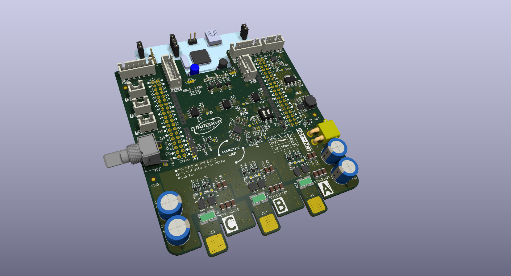
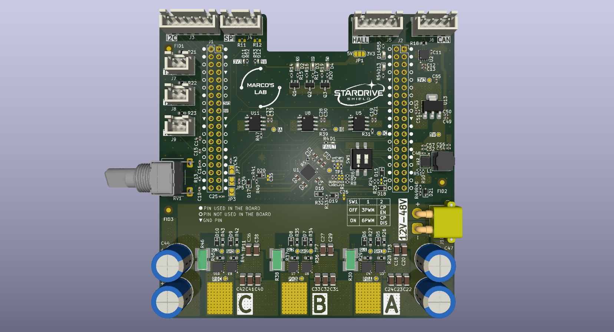
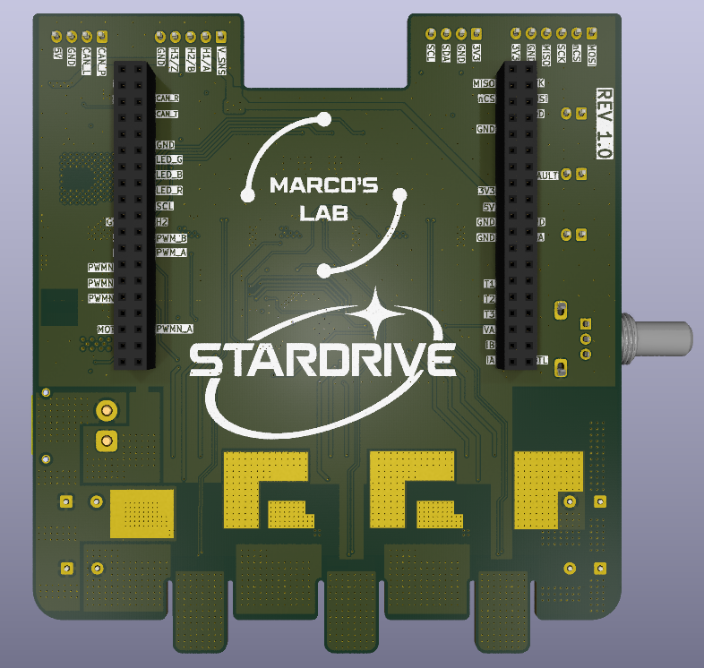

# STARDRIVE SHIELD

## Introduction
This project has been born because I have been trying to develop an ESC (hardware and firmware) on my own. 
While the most challenging part has been the firmware (being myself a hardware guy), the most frustrating part has been not finding a flexible hardware platform to develop upon.

So I designed one: **STARDRIVE SHIELD**

## Description 
This is a project with the goal of creating a NUCLEO-64 compatible shield to be used as a flexible platform to develop and test ESC firmware, but also for educational purposes. To do so, I included as many features as possible. These features are not mandatory, but they can be implemented (or not) in the firmware (e.g. SPI, I2C, CAN, HALL) or configured through the hardware interface (e.g. overcurrent protection, 6 or 3 PWM). In this way, the STARDRIVE SHIELD grants flexibility to the developer and it is adapt to various needs.

## Features
The **STARDRIVE SHIELD** is built around the [STDRIVE101](https://www.st.com/en/power-management/stdrive101.html)  gate driver and implementing [BSZ099N06LS5](https://www.infineon.com/part/BSZ099N06LS5) MOSFETs.
It presents 3 in-line shunt resistors and 3 relative [INA240A2](https://www.ti.com/lit/ds/symlink/ina240.pdf?ts=1785176124311&ref_url=https%253A%252F%252Fwww.google.com%252F) current sense amplifiers.

With **STARDRIVE SHIELD** you can implement from 6 step to FOC motor control algorithms.

I designed it to be compatible with Nucleo-G474 and Nucleo-F446. Compatibility with other boards has to be verified. 

### Electrical Characteristics
+ Inprut Voltage Vin = 12 - 48 V
+ Maximum DC current Idc,max = 20 A

### Hardware Characteristiscs
+ Three phase gate driver [STDRIVE101](https://www.st.com/en/power-management/stdrive101.html)
  + Configurable 3PWM or 6PWM through the DIP switch
  + Overcurrent protection can be enabled or disabled through the DIP switch.
  + Vds protection configurable with resistor divider (disabled by default)
+ [BSZ099N06LS5](https://www.infineon.com/part/BSZ099N06LS5) MOSFETs
+ 3 in-line shunt resistors (1mOhm) with relative 3 INA240A2 Current Sensors
+ JST connectors to implement:
  + I2C (e.g. for magnetic encoder such as [AS5046](https://mm.digikey.com/Volume0/opasdata/d220001/medias/docus/1138/AS5046.pdf))
  + SPI (e.g. for magnetic encoder such as [AS5047P](https://look.ams-osram.com/m/d05ee39221f9857/original/AS5047P-DS000324.pdf))
  + CAN
  + HALL sensors (some BLDC motors have embedded Hall sensors)
  + 3 NTC temperature sensors
+ 10k Potentiometer to use as throttle signal (or whatever you want)
+ 3 GPIO driven LEDs (1 Red, 1 Blue, 1 Green)
+ 1 FAULT LED (RED)
+ CAN RX and TX LEDs
+ Power Good LEDs

## Inspirations
For this project I took inspiration from the [VESC Project](https://vesc-project.com/) and [EVALSTDRIVE101](https://www.st.com/en/evaluation-tools/evalstdrive101.html#cad-resources)
